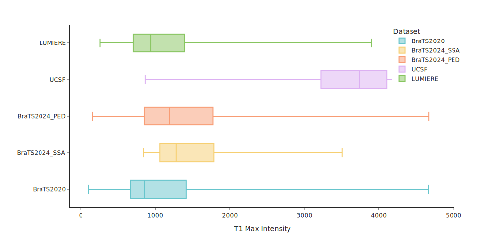
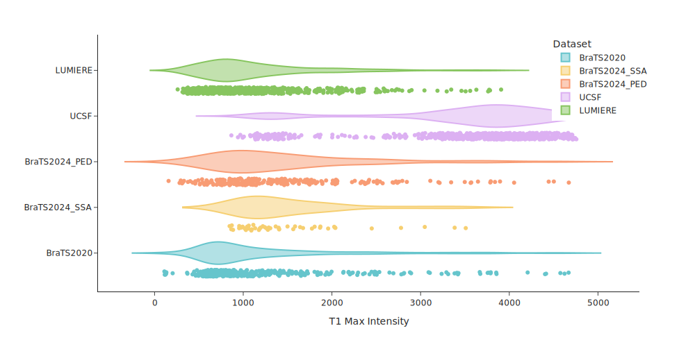
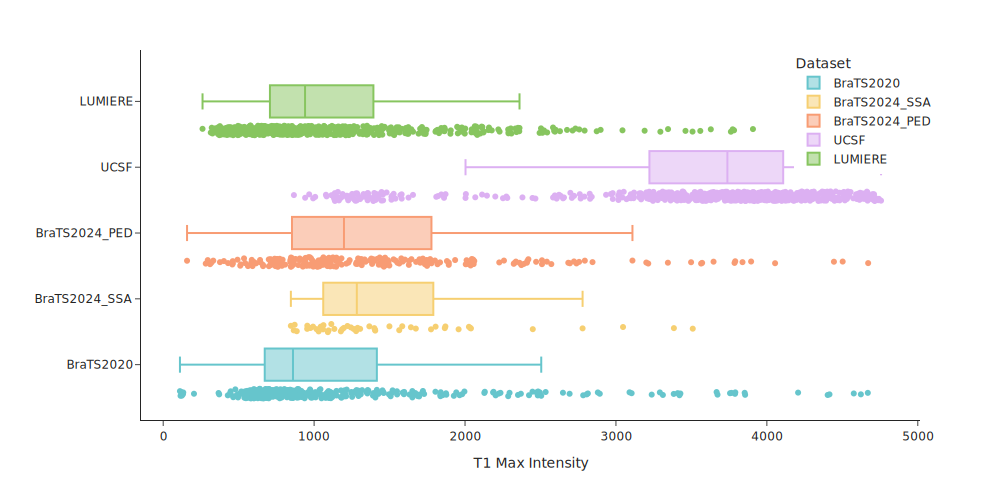
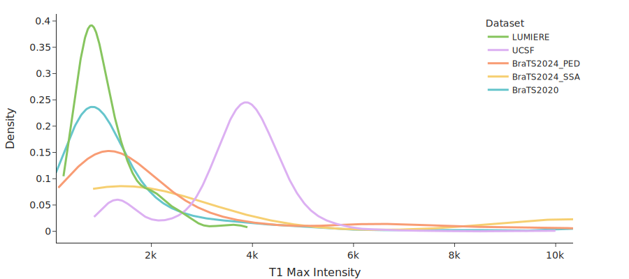
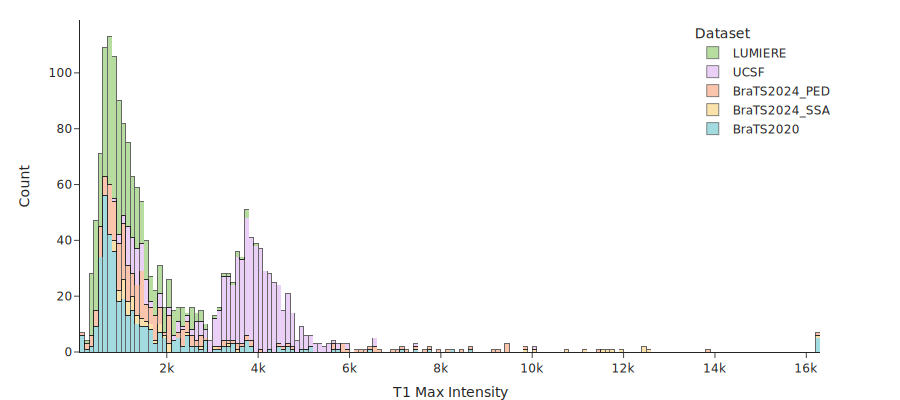

# Univariate feature analysis

The **Univariate analysis mode** in AUDIT provides a comprehensive and intuitive way to explore how a single variable 
relates to the behavior of a segmentation model, or to differences across datasets. This mode supports descriptive 
analytics through visual exploration, enabling researchers to detect outliers, identify dataset shifts, and understand 
variability in imaging or metadata features that may influence downstream model performance.

---

The purpose of univariate analysis is to:

- **Compare datasets or cohorts** based on a single feature of interest.
- **Explore the distribution** of quantitative relevant features (statistical, texture, tumor, etc.).
- **Detect outliers** or atypical cases that may affect downstream modeling.
- **Identify dataset shifts** (e.g., site or scanner variability).
- **Visualize central tendencies and variability** in the selected feature.

---

## 🎥 Demo video

Below is a short video that walks you through the homepage interface:

---

## ⚙️ User configuration

### 1. **Dataset Selection**

Users can load and compare multiple datasets simultaneously in the Univariate analysis mode. This 
enables side-by-side inspection of how a given feature varies across different cohorts — for example, 
across different institutions, scanner protocols, or study years.

Each dataset is automatically assigned a distinct color in all plots, ensuring an easy interpretation.

Datasets can be:

- Selected or deselected using the dedicated selector panel on the left-hand side of the dashboard.
- Toggled directly from the interactive Plotly legend, which allows temporary hiding/showing of datasets with a single click.

While the Plotly legend interaction is useful for quick comparisons, we recommend using the left-side dataset selector 
for a more stable and consistent user experience, especially when exporting plots or applying filters.

### 2. **Feature Selection**

Users can choose from different feature categories such as:

| Feature      | Description                                                                  | Example                                 |
|:-------------|:-----------------------------------------------------------------------------|:----------------------------------------|
| Statistical  | Descriptive measures derived from intensity distributions.                   | Mean, standard deviation, maximum       |
| Texture      | Quantitative descriptors of local intensity patterns (GLCM-based).           | Entropy, contrast, homogeneity          |
| Spatial      | Anatomical or geometric positioning of segmented regions.                    | Center of mass (x, y, z)                |
| Tumor        | Morphological properties extracted from segmentation masks.                  | Lesion volume, tumor location           |

Some features depend heavily on the imaging modality, and comparisons between datasets are only meaningful when 
extracted from preprocessed MRIs. Texture features in particular are highly sensitive to variations in acquisition 
protocols and preprocessing pipelines. This sensitivity arises because descriptors like entropy, contrast, and energy 
are affected by voxel size and image spacing, intensity range and quantization strategy, and other technical aspects 
related to the scanners. Such technical differences are especially relevant in multi-center studies, where spatial 
resolution and image quality may vary substantially.

Other features, such as tumor volume, center of mass, or spatial location, are typically derived from segmentation 
masks that take into account the voxel spacing, and are independent of intensity information. These are more robust 
to differences in acquisition and preprocessing, making them suitable for comparisons even across heterogeneous cohorts.

!!! info
    _More technical details can be found in_ [our publication](https://arxiv.org/) _and within the_ [API reference](https://caumente.github.io/AUDIT/API_reference/features/feature_extraction/).

---

### 3. **Filtering**

Several filtering strategies are available to clean or constrain the data prior to visualization:

- **No filter**: Show all data as-is.
- **Removing outliers**: Exclude points out of a range of values provided by the users.
- **Clipping outliers**: Truncate values beyond a user-defined threshold.
- **Standard deviation-based filtering**: Retain only values within a specified number of standard deviations from the mean.

This helps in focusing on the core structure of the data, minimizing the impact of extreme values.

!!! warning
    Some filters or parameter settings may be overly restrictive, reducing the number of visible data points and affecting the interpretability of the visualizations. We encourage users to carefully adjust filtering thresholds depending on the context and data distribution.

### 4. **Highlight subject**

The _Highlight subject_ option allows users to trace the behavior of an individual patient (or subject) across 
plots. By entering a specific subject ID and specifying the corresponding dataset, the selected subject will be 
visually highlighted in Boxplots and Violinplots, where the subject appears as a clearly marked point (e.g., with a 
different color or shape).

This feature is particularly valuable in contexts such as detecting whether a subject is an outlier or aligns with cohort 
expectations or verifying how individuals from different cohorts are distributed in shared feature space.

The subject remains highlighted even when toggling between plot types, making it easier to interpret its relative 
position under different visual perspectives.

!!! tip
    When analyzing extreme values, this feature can help determine whether a subject truly deviates from the cohort or lies within natural variability.

---

## 📊 Visualizations

The **Univariate analysis mode** provides two dedicated dashboards, each tailored to a specific type of visual 
exploration:

---

#### Dashboard 1: Distribution by dataset

This view allows users to compare feature distributions across datasets or groups using statistical summaries and 
individual data points.

##### **Box**
Displays the median, interquartile range, and potential outliers for each group.  
Useful for comparing central tendency and variability between datasets.

> 
> *Figure 1:* This box plot summarizes the subject-level distribution of a selected feature across multiple datasets, showing median, quartiles, and outliers.

 
##### **Violin Plot**
Extends the boxplot with a mirrored kernel density estimation, offering insight into the shape of the distribution 
(e.g., multimodality or skewness).  
Great for identifying subtle differences between groups.

> 
> *Figure 2:* Violin plots illustrate the full shape of feature distributions across datasets, useful for spotting multimodal or skewed distributions.

 
##### **Box + Points**
Combines a boxplot with individual data points overlaid.  

> 
> *Figure 3:* Box + Points visualization combines summary statistics with subject-level markers, making it easier to spot trends or anomalies within groups.

---

#### Dashboard 2: Global Distribution Shape

This view focuses on the overall shape and structure of the feature distribution across datasets.

##### **Probability Density (Smoothed Distribution)**
Displays a smoothed estimate of the probability density function (PDF) for each dataset, often using kernel density estimation.

> 
> *Figure 4:* Probability density functions estimate the underlying shape of feature distributions, revealing subtle differences in central tendency and spread.

##### **Histogram**
Shows the frequency of observations grouped into bins.

> 
> *Figure 5:* Histograms display the frequency distribution of a selected feature across datasets, allowing users to tune bin width for detailed or coarse analysis.

When using the _Histogram_ plot, users can configure the number of bins used to partition the feature range. This 
setting controls the granularity of the histogram. Typically, a smaller number of bins results in broader, coarser 
groupings, which can help reveal overall distribution trends. In contrast, a larger number of bins produces a more 
detailed view, potentially exposing finer structure or noise in the data.

This setting is especially useful when exploring skewed, sparse, or multimodal distributions, where default binning may 
obscure relevant patterns.

!!! warning
    Despite the number defined in the settings, Plotly may automatically adjust the bin size and number of bins to optimize the visualization. As a result, the final number of bins rendered may not exactly match the user’s input.

---

All plots are interactive, powered by _Plotly_, allowing users to:

- Toggle datasets on and off
- Zoom and pan within plots
- Export high-resolution images
- Hover to inspect exact values

Whether you're debugging unexpected results or preparing figures for publication, this analysis mode is a core part of 
the AUDIT toolkit.

